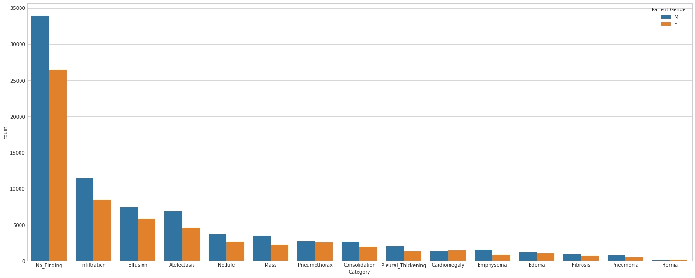
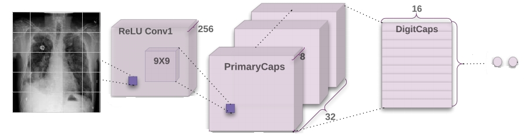

# Diseases Detection from Chest X-ray data
Machine Learning Capstone Project - Udacity MLND

## Project Overview
With so many lung diseases people can get, here is just one example of diseases we can save if we find them out earlier.
With the technology machine and computer power, the earlier identification of diseases, particularly lung disease, we can be helped to detect earlier and more accurately, which can save many many people as well as reduce the pressure on the system. The health system has not developed in time with the development of the population.

## Analysis
### Data Exploration

### Exploratory Visualization


## Datasets
### [Sample dataset](https://www.kaggle.com/nih-chest-xrays/sample)
* File contents: this is a random sample (5%) of the full dataset:
 sample.zip: Contains 5,606 images with size 1024 x 1024
 sample_labels.csv: Class labels and patient data for the entire dataset
* Class descriptions: there are 15 classes (14 diseases, and one for "No findings") in the full dataset, but since this is drastically reduced version of the full dataset, some of the classes are sparse with the labeled as "No findings": Hernia - 13 images, Pneumonia - 62 images, Fibrosis - 84 images, Edema - 118 images, Emphysema - 127 images, Cardiomegaly - 141 images, Pleural_Thickening - 176 images, Consolidation - 226 images, Pneumothorax - 271 images, Mass - 284 images, Nodule - 313 images, Atelectasis - 508 images, Effusion - 644 images, Infiltration - 967 images, No Finding - 3044 images.
### [Full dataset](https://www.kaggle.com/nih-chest-xrays/data)
* File contents:
 images_00x.zip: 12 files with 112,120 total images with size 1024 x 1024
 README_ChestXray.pdf: Original README file
 BBox_list_2017.csv: Bounding box coordinates. Note: Start at x,y, extend horizontally w pixels, and vertically h pixels
 Data_entry_2017.csv: Class labels and patient data for the entire dataset
* Class descriptions: there are 15 classes (14 diseases, and one for "No findings"). Images can be classified as "No findings" or one or more disease classes: Atelectasis, Consolidation, Infiltration, Pneumothorax, Edema, Emphysema, Fibrosis, Effusion, Pneumonia, Pleural_thickening, Cardiomegaly, Nodule Mass, Hernia.

## Algorithms and Techniques
* CNN
* Spacial Transformer
* VGG finetuning
* Capsule Network
### Architecture

#### Vallina CNN


#### Optimized CNN


#### CapsNet


## Metrics & Result
F-beta score with β = 0.5 to represent precision will be more important than recall in this case.

Result:
In sample dataset:

| Model | Precision | Recall | F 0.5 score | Accuracy | Training time/ epoch | no. parameters |
| ------ | ------ | ------ | ------ | ------ | ------ | ------ |
| Vanilla rgb	| 0.617	| 0.589	| 0.611	| 0.503	| 2 s	| 322793 |
| Vanilla gray	| 0.577	| 0.48	| 0.555	| 0.517	| 2 s	| 321225 | 
| CNN + VGG	| 0.645	| 0.555	| 0.624	| 0.667	| 16 s	| 15252133 | 
| CNN + VGG + data	| 0.647	| 0.588	| 0.634	| 0.675	| 16 s	| 15240769 | 
| CNN + VGG + data + STN	| 0.642	| 0.614	| 0.636	| 0.677	| 19 s	| 15488051 | 
| CapsNet basic	| 0.614	| 0.599	| 0.611	| 0.581	| 75 s	| 14788864 | 
| CapsNet changed	| 0.735	| 0.073	| 0.261	| 0.575	| 37 s	| 12167424 | 

In full dataset:

| Model | Precision | Recall | F 0.5 score | Accuracy | Training time/ epoch | no. parameters |
| ------ | ------ | ------ | ------ | ------ | ------ | ------ |
| Vanilla rgb	| 0.672	| 0.594	| 0.655	| 0.672	| 53 s	| 322793 | 
| Vanilla gray	| 0.672	| 0.572	| 0.649	| 0.667	| 51 s	| 321225 | 
| CNN + VGG	| 0.675	| 0.619	| 0.663	| 0.688	| 384 s	| 15252133 | 
| CNN + VGG + data + STN	| 0.684	| 0.621	| 0.67	| 0.693	| 431 s	| 15488051 | 
| CapsNet basic	| 0.64	| 0.498	| 0.605	| 0.635	| 1815 s	| 14788864 | 
| CapsNet changed	| 0.625	| 0.474	| 0.588	| 0.625	| 856 s	| 12167424 |  

## Installation
### [Jupyter Notebook](http://jupyter.readthedocs.io/en/latest/install.html) with [python3](http://docs.python-guide.org/en/latest/starting/install3/linux/)
```sh
$ sudo apt-get update
$ sudo apt-get install python3-pip python3-dev
$ pip3 install --upgrade pip
$ pip3 install jupyter
```
### [Tensorflow](https://www.tensorflow.org/install/install_linux) for GPU
```sh
$ pip3 install tensorflow     # Python 3.n; CPU support (no GPU support)
$ pip3 install tensorflow-gpu # Python 3.n; GPU support 
```
### [Keras](https://keras.io/#installation) for GPU
```sh
$ pip3 install keras
```
### Others
* numpy
* pandas
* seaborn
* matplotlib
* opencv
* glob
* tqdm
* sklearn
* pickle

## Note

1. Following are the file descriptions and URL’s from which the data can be obtained:
• data sample/sample_labels.csv: Class labels and patient data for the sample dataset
• data sample/Data_entry_2017.csv: Class labels and patient data for the full dataset
• data sample/images/*: 10 chest X-ray images

2. Following are the notebooks descriptions and python files descriptions, files log:
Notebooks:
• Capsule Network - FullDataset.ipynb: Capsule Network with my architecture in full dataset
• Capsule Network - SampleDataset.ipynb: Capsule Network with my architecture in sample dataset
• Capsule Network basic - FullDataset.ipynb: Capsule Network with Hinton's architecture in full dataset
• Capsule Network basic - SampleDataset.ipynb: Capsule Network with Hinton's architecture in sample dataset
• Data analysis - FullDataset.ipynb: Data analysis in full dataset
• Data analysis - SampleDataset.ipynb: data analysis in sample dataset
• Data preprocessing - SampleDataset.ipynb: Data preprocessing
• Demo.ipynb: Demo prediction 20 samples
• optimized CNN - FullDataset.ipynb: My optimized CNN architecture in full dataset
• optimized CNN - SampleDataset.ipynb: My optimized CNN architecture in sample dataset
• vanilla CNN - FullDataset.ipynb: Vanilla CNN in full dataset
• vanilla CNN - SampleDataset.ipynb: Vanilla CNN in sample dataset

Python files
• capsulelayers.py: capsule layer from https://github.com/XifengGuo/CapsNet-Keras
• spatial_transformer.py: spatial transformer layser from https://github.com/hello2all/GTSRB_Keras_STN
So thank you guys for support me with capsule layer and spatial transformer layer in Keras-gpu

Log:
• FullDataset Log: all log file in full dataset
• SampleDataset Log: all log file in sample dataset
